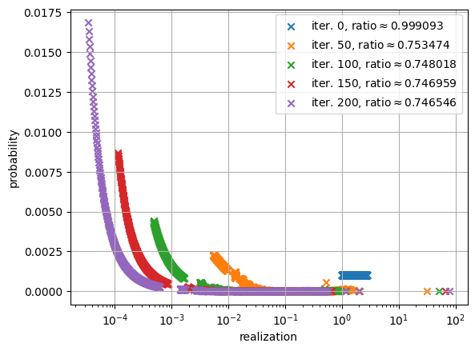

# Searching for worst-case inputs with gradient-based optimization in prophet settings 

This repository contains [jax](https://github.com/google/jax) implementations of algorithms that calculate the expected performance of optimal algorithms for prophet scenarios. 

## Introduction

In the analysis of approximation algorithms, the competitive ratio of an algorithm for a given input $I$ is the performance of the algorithm $\text{alg}(I)$ divided by the optimal solution $\text{opt}(I)$.

It is often desired to find the overall competitive ratio of an algorithm. In a problem where the goal of the algorithm is to maximize some target function, it is defined as

$$ \text{competitive ratio}(\text{alg}) := \min_I \frac{\text{alg}(I)}{\text{opt}(I)}.$$

A competitive ratio of an algorithm therefore represents a guarantee of performance. If an algorithm has a competitive ratio of $0.5$ then it will always produce a solution that is at least half as good as the optimal solution. 

Showing that an algorithm has a competitive ratio of $\alpha$ usually consists of two steps: 

1. Proving that for all possible inputs $I$ the algorithm achieves at least $\alpha \cdot \text{opt}(I)$.

2. Providing an input $I$ where the algorithm produces a solution with value $\alpha \cdot \text{opt}(I)$.

This project concerns itself with the second step, finding an instance that is hard for a given algorithm. The novel idea of this project is to employ gradient-based optimization to construct such an input. We apply this technique to a family of online stopping problems best known for the so-called [Prophet Inequality](https://en.wikipedia.org/wiki/Prophet_inequality). Note that in prophet scenarios, we are interested in the ratio of the *expected* performance of the algorithm compared to the *expected* optimum.

In the classic online prophet setting, $n$ objects are given, with each object having an initially unknown value. The values of the objects are drawn from known, independent distributions. The aim is to select exactly one of the objects with a value as large as possible. To do this, the values of the objects are revealed in a fixed order. In each step, a decision must be made as to whether the current object should be accepted or rejected, with all decisions being final. 

We provide jax implementations of algorithms that calculate the competitive ratio of optimal algorithms for the online and semi-online prophet setting for given random variables. Optimal means that the expected value of the chosen item is maximized for all possible input distributions. 

Leveraging jax's automatic differentation and just-in-time compilation features, the competitive ratio is minimized by employing gradient based optimization with respect to the input distributions in an efficient manner. Since we restrict ourselves to optimal algorithms, our found upper bounds apply to all possible algorithms.

## Results

| |
|:--:|
| Visualization of the iterative optimization process. |

 

The following table lists the competitive ratio of distributions found with this method for different settings. $n$ is the number of distributions, and $m$ is the number of realizations of all distributions.

| | i.i.d | non i.i.d |
|----------|----------|----------|
| online | $<0.746\ (n=1000,\ m=1000)$ | $<0.51\ (n=2,\ m=2)$ |
| semi-online | $<0.911\ (n=1000,\ m=1000)$ | $<0.86\ (n=40,\ m=100)$ |

For the online i.i.d and non i.i.d setting the method finds distributions with competitive ratios close to the known sharp bounds. For the semi-online i.i.d and non i.i.d setting, new smaller upper bounds are identified.

| |Secretary | Order Selection |
|----------|----------|----------|
|standard | $<0.734 \ (n=10,\ m=12) $ | $<0.771 \ (n=10,\ m=12)$ |
|2 distributions | $<0.726 \ (n=200, m=200)$ | $<0.747 \ (n=500, m=50)$ |

In the prophet secretary case, the critical 0.7451 mark is beaten by a relatively small $n$. This is not the case for the order selection setting. In the "2 distribution settings", $n-1$ variables follow the same distribution, drastically reducing the number of permutations.

All calculations were done with 64 bit precision. Note the inherit imprecisions when dealing with floating point numbers, all calculated competitive ratios should therefore be treated with caution.

The experiments where conducted out with python 3.10, jax 0.4.7 and optax 0.1.7 on a Nvidia A100 GPU (large amount of vram is only necessary for the secretary and order selection variant.).

### Example usage:
```
from jax import config
config.update("jax_enable_x64", True)
from prophet_utils.iid_utils import competitive_ratio_semi_online

import jax.numpy as jnp

n = 1000
r = jnp.asarray([0., 1., 2., 3.])
p = jnp.asarray([1 - 3/n, 1/n, 1/n, 1/n])

print(competitive_ratio_semi_online(r, p, n))
```
Result: 0.9799121626421243

See the [notebooks](notebooks) for other examples, including gradient-based optimization.


### If the distributions are changed based on the gradients, how is ensured that the result is still a valid distribution?

This is solved by optimizing a function that first normalizes its inputs, turning them into valid distributions, and then passes these to a function that calculates the competitive ratio. This allows the optimizer to optimize over arbitrary real-valued inputs.

## References

The semi-online setting was proposed [here](https://arxiv.org/abs/2307.01776).
